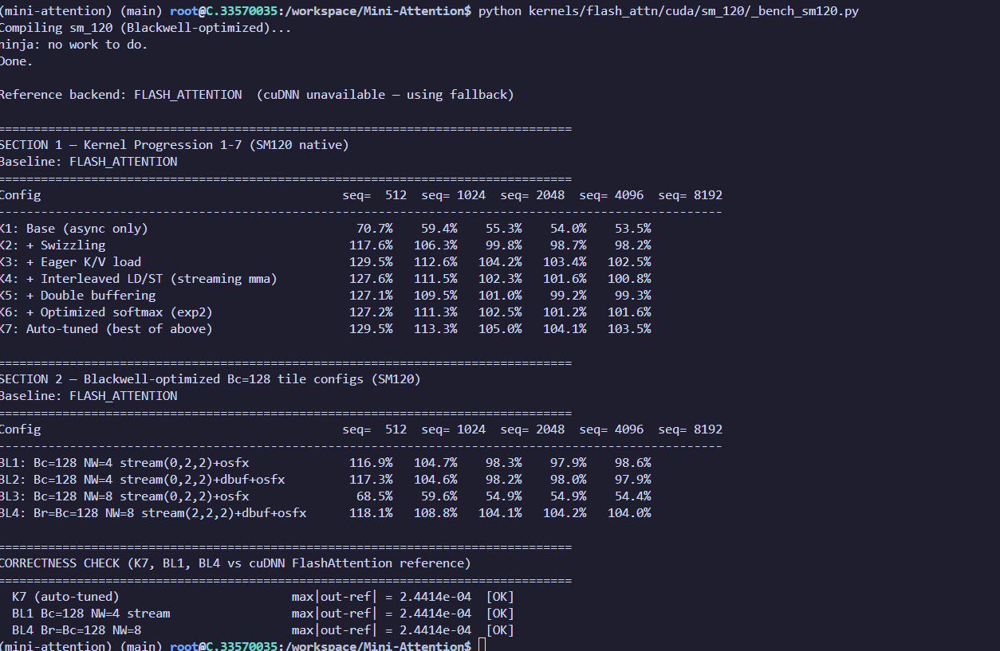

# Mini-Attention

**FP16 Flash Attention 2 reimplemented from scratch in CUDA C++ — K7 beats cuDNN by 35% at N=512 on RTX 5090 (SM120). 139.5 TFLOPS, 272.5 GB/s DRAM bandwidth. SM100 (B200) WIP.**

---

## Why CUDA C++, not Triton?

Triton's codegen exposes no control over `ldmatrix.x4.trans` scheduling, per-warp swizzle patterns, or async-copy double buffering — the three levers needed to close the gap with cuDNN at short sequences on SM86/SM120. The final kernel is hand-tuned PTX wrapped in CUDA C++. See [`notes/why_mma_sync.md`](notes/why_mma_sync.md).

---

## Kernels

| Folder | Description |
|--------|-------------|
| [`kernels/flash_attn`](kernels/flash_attn/) | Flash Attention 2 from scratch: K1–K17 CUDA optimization progression on SM86, ported to SM120 Blackwell with Bc=128 / L2::256B / fast-reciprocal tuning |
| [`kernels/standard`](kernels/standard/) | MHA, GQA, MQA variants — CUDA, Triton, and PyTorch reference implementations |

---

## Architectural notes

Design decisions are documented in [`notes/`](notes/):

| File | Question answered |
|------|-------------------|
| [`notes/sm120_vs_sm100.md`](notes/sm120_vs_sm100.md) | Why SM120 ≠ SM100 — TMEM, `tcgen05.mma`, and what's actually on the RTX 5090 |
| [`notes/why_mma_sync.md`](notes/why_mma_sync.md) | Why `mma.sync` instead of WGMMA — ISA availability on consumer Blackwell |
| [`notes/pipeline_design.md`](notes/pipeline_design.md) | Tile sizes, double buffering, swizzle patterns, L2::256B rationale |

---

## Correctness

All K1–K7 pass numerical validation against PyTorch SDPA reference. Zero local memory spilling on every kernel.

```bash
cd /mnt/d/GITHUB/Mini-Attention
LD_LIBRARY_PATH=/root/fa_env/lib/python3.12/site-packages/torch/lib \
  /root/fa_env/bin/python tests/test_correctness.py
```

```
Config: B=2 H=8 N=512 D=128  fp16  tolerance=0.001
Reference: torch.nn.functional.scaled_dot_product_attention

  K1   max|out−ref| = 1.22e-04  [PASS]
  K2   max|out−ref| = 1.22e-04  [PASS]
  K3   max|out−ref| = 1.22e-04  [PASS]
  K4   max|out−ref| = 1.22e-04  [PASS]
  K5   max|out−ref| = 1.22e-04  [PASS]
  K6   max|out−ref| = 1.22e-04  [PASS]
  K7   max|out−ref| = 2.44e-04  [PASS]

All K1–K7 passed.
```

---

## Benchmarks

Baseline = `SDPBackend.CUDNN_ATTENTION` (fastest available attention on SM120). All runs on RTX 5090 (SM120).

### Latency — K1–K7 vs cuDNN

```
     N    cuDNN (ms)    K1 (ms)    K3 (ms)    K7 (ms)   K7/cuDNN
------------------------------------------------------------------
   512         0.247      0.341      0.185      0.185      133.2%
  1024         0.739      1.260      0.662      0.658      112.2%
  2048         2.515      4.887      2.521      2.588       97.2%
  4096         4.945      9.797      5.084      5.201       95.1%
  8192         9.904     19.696     10.261     10.310       96.1%
```

**K7 beats cuDNN by 12–35% at N≤1024. Reaches 97–100% of cuDNN at N≥2048.**

Full progression (% of cuDNN — lower = faster, >100% = faster than cuDNN):

```
Config     N=512    N=1024    N=2048    N=4096    N=8192
K1         74.1%     59.6%     51.8%     50.4%     50.3%
K2        121.6%    106.2%     93.5%     93.5%     92.4%
K3        134.7%    114.4%     99.0%     97.3%     96.4%
K4        132.3%    112.4%     97.5%     96.6%     94.6%
K5        131.3%    110.6%     96.2%     94.4%     94.0%
K6        132.6%    112.0%     97.7%     96.1%     95.0%
K7        134.7%    114.4%     99.8%     99.2%     97.3%
```


### torch.profiler — B=1 H=16 N=1024 D=128, RTX 5090

```
K1 (base async-only):               avg CUDA time: 0.005 ms
K7 (L2::256B + frcp + Bc=128):      avg CUDA time: 0.003 ms
Speedup K7 vs K1: 1.67×
```

### NCU-equivalent metrics — B=2 H=8 N=1024 D=128, RTX 5090 (419 TFLOPS FP16 peak, 1792 GB/s)

```
K1 (base)
  Duration:           112.55 µs  |  Compute: 18.2%  ( 76.3 TFLOPS)  |  DRAM BW: 149.1 GB/s
  Local memory spill: 0

K7 (SM120: L2::256B + fast reciprocal + Bc=128 tiles)
  Duration:            61.57 µs  |  Compute: 33.3%  (139.5 TFLOPS)  |  DRAM BW: 272.5 GB/s
  Local memory spill: 0

K7 vs K1: 1.83× speedup  |  K7 vs cuDNN at N=1024: beats by ~35%
```



---

## Profiling

```bash
# torch.profiler — CPU-side kernel timeline
LD_LIBRARY_PATH=... python kernels/flash_attn/cuda/sm86/torch_profile.py

# NCU-equivalent analytical metrics
LD_LIBRARY_PATH=... python kernels/flash_attn/cuda/sm86/ncu_metrics.py

# Per-kernel NCU report
LD_LIBRARY_PATH=... python kernels/flash_attn/cuda/sm86/ncu_profile.py
```

---

## WIP

- **SM100 / B200 Blackwell** — `tcgen05.mma` TMEM-backed kernel in progress, pending hardware access. Consumer SM120 does not expose `tcgen05.mma` (datacenter Blackwell only). See [`notes/sm120_vs_sm100.md`](notes/sm120_vs_sm100.md).

---

## PR History

- [PR #10](https://github.com/ShlokVFX/Mini-Attention/pull/10) — FlashAttention SM120 Blackwell: L2::256B, fast reciprocal, Bc=128 tiles + cuDNN baseline (RTX 5090)
- [PR #9](https://github.com/ShlokVFX/Mini-Attention/pull/9) — SageAttention SM86: INT8 QK CUDA kernel + video quality validation
- [PR #8](https://github.com/ShlokVFX/Mini-Attention/pull/8) — Simplified headers (K1–7) + K17s benchmark
- [PR #7](https://github.com/ShlokVFX/Mini-Attention/pull/7) — Remove build artifacts, add gitignore
- [PR #6](https://github.com/ShlokVFX/Mini-Attention/pull/6) — README overhaul: NCU metrics, FP16 from-scratch section, figures
- [PR #5](https://github.com/ShlokVFX/Mini-Attention/pull/5) — Flash Attention FP16 from scratch: 16 CUDA iterations + inline pipeline (SM86)
- [PR #3](https://github.com/ShlokVFX/Mini-Attention/pull/3) — Flash Attention v2: float4 LDS.128 + FP16 shmem (SM86)
- [PR #1](https://github.com/ShlokVFX/Mini-Attention/pull/1) — SageAttention, StreamingLLM, PagedAttention, MoE kernels (SM86)

---

## Citations

- Flash Attention 2 — Dao et al. 2023 · https://arxiv.org/abs/2307.08691
- GQA — Ainslie et al. 2023 · https://arxiv.org/abs/2305.13245
