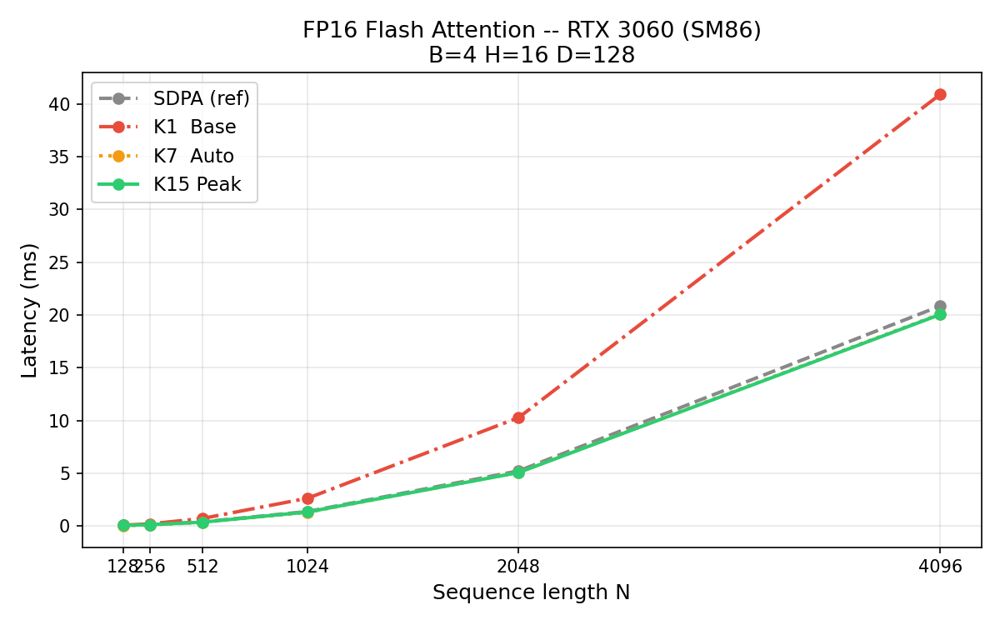
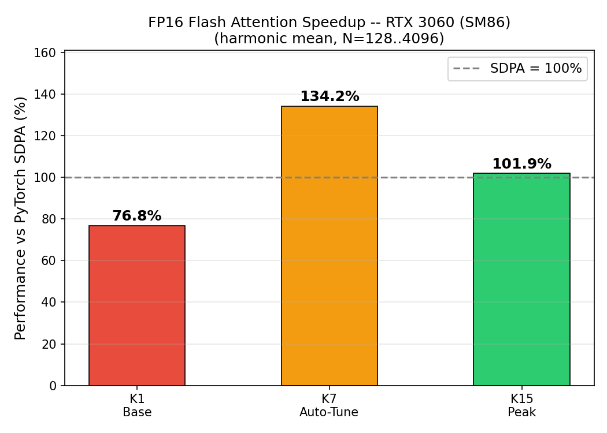

# Flash Attention — CUDA (SM86 / RTX 3060)

FP16 Flash Attention 2 forward pass, 16 progressive optimization iterations hand-written in CUDA C++ and fully self-contained as single Python files.

---

## Directory layout

```
kernels/flash_attn/cuda/
  fp32_flash_attn_sm86.py     FP32 baseline (load_inline, simple)
  bench_flash_attn.py         Latency table + matplotlib figures
  torch_profile.py            torch.profiler per-kernel timing
  ncu_metrics.py              Analytical NCU-equivalent metrics
  gen_inline.py               Converts kernel dirs → standalone Python files

  kernels/                    CUDA source directories (SM86 target)
    src_1-7/                  Kernels 1–7 (one binary, config-driven)
    src_8/ … src_16/          Kernels 8–16 (one binary per iteration)

  py/flash_helpers/           Python config + progression helpers
    kernel_configs.py

  inline/                     Auto-generated standalone files (one per iteration)
    fp16_k1_sm86.py  …  fp16_k16_sm86.py
```

---

## Kernel iterations

| # | Optimization | Harm. mean vs SDPA |
|---|---|---:|
| 1 | Base Implementation (async copy, no swizzle) | 51.9% |
| 2 | Shared-memory swizzling (bank-conflict free) | 102.0% |
| 3 | Eagerly Loading K & V | 105.5% |
| 4 | Interleaving LD/ST (tile pipelining) | 103.6% |
| 5 | Double Buffering SMEM→RF | 104.9% |
| 6 | Improving FP32 Throughput | 105.4% |
| 7 | Auto-Tuning (best static config) | **106.7%** |
| 8 | Reducing IADD3/LOP3/SHF | 105.9% |
| 9 | Reducing IMAD.MOV/MOV | 106.2% |
| 10 | Removing CSRZ + Optimized Softmax | 106.3% |
| 11 | Encoded Swizzling RF→SMEM | 106.2% |
| 12 | Misc Code Changes | 100.4% |
| 13 | Iterating Backwards | 103.1% |
| 14 | Cache Configuration | 104.3% |
| 15 | Tiling along d\_head | **107.0%** |
| 16 | Static GMEM Stride | 104.7% |

Reference = PyTorch `scaled_dot_product_attention` (Flash Attention backend) = 100%.
Config: d\_head=128, n\_heads=16, FP16, N=512–8192, RTX 3060 (28 SMs, 12 GB).

---

## Quick start — run one inline file

Each `inline/fp16_kN_sm86.py` is fully self-contained: no external `.cu` files needed.
On first run it decompresses the embedded CUDA source, compiles via nvcc, and caches the `.so`.

```bash
# From repo root, WSL terminal:
cd /mnt/d/GITHUB/Mini-Attention
LD_LIBRARY_PATH=/root/fa_env/lib/python3.12/site-packages/torch/lib \
  /root/fa_env/bin/python kernels/flash_attn/cuda/inline/fp16_k16_sm86.py
```

Expected output:
```
K16 [Static GMEM Stride]  max|out-ref|=1.2207e-04  OK
  latency: 2.54 ms  SDPA: 2.62 ms  rel: 103.1%
```

> **Note:** First run compiles the CUDA kernel (~5–15 min for K16 due to template instantiations).
> Subsequent runs load the cached `.so` instantly.

---

## Use as a library

```python
from kernels.flash_attn.cuda.inline.fp16_k16_sm86 import forward

q = torch.randn(4, 1024, 16, 128, dtype=torch.float16, device="cuda")
k = torch.randn_like(q)
v = torch.randn_like(q)

out = forward(q, k, v)   # (B, N, H, D) float16
```

Tensor layout: `(batch, seq_len, n_heads, head_dim)` — same as the educational project.

---

## Regenerate inline files

If you modify a kernel source in `kernels/`, regenerate the inline Python files:

```bash
# All 16:
/root/fa_env/bin/python kernels/flash_attn/cuda/gen_inline.py

# Single iteration:
/root/fa_env/bin/python kernels/flash_attn/cuda/gen_inline.py --iter 16
```

---

## Benchmarks

```bash
LD_LIBRARY_PATH=... /root/fa_env/bin/python kernels/flash_attn/cuda/bench_flash_attn.py
```

### Latency (ms) — B=4 H=16 D=128, RTX 3060

```
     N    SDPA (ref)    K1  Base    K7  Auto   K16 Final
-------------------------------------------------------
   128      0.075 ms   0.085 ms   0.051 ms   0.054 ms
   256      0.136 ms   0.233 ms   0.130 ms   0.115 ms
   512      0.400 ms   0.708 ms   0.355 ms   0.377 ms
  1024      1.382 ms   2.639 ms   1.293 ms   1.321 ms
  2048      5.226 ms  10.274 ms   5.081 ms   5.096 ms
  4096     20.791 ms  40.867 ms  20.026 ms  20.089 ms
```

### Speedup vs SDPA

```
     N    K1  Base    K7  Auto   K16 Final
------------------------------------------
   128      88.0%     146.0%     137.8%
   256      58.4%     104.7%     118.7%
   512      56.6%     112.9%     106.3%
  1024      52.4%     106.8%     104.6%
  2048      50.9%     102.9%     102.6%
  4096      50.9%     103.8%     103.5%
```




---

## torch.profiler

```bash
LD_LIBRARY_PATH=... /root/fa_env/bin/python kernels/flash_attn/cuda/torch_profile.py
```

Config: B=1 H=4 N=1024 D=128

```
=== K1 (Base Implementation) ===
cudaLaunchKernel    342 us / 20 calls  (17 us/call)
cudaDeviceSynchronize  4.238 ms total

=== K16 (Static GMEM Stride) ===
cudaLaunchKernel    399 us / 20 calls  (20 us/call)
cudaDeviceSynchronize  1.550 ms total   ← 2.7× less sync overhead than K1

=== SDPA (PyTorch reference) ===
aten::_flash_attention_forward  1.978 ms / 20 calls  (99 us/call)
```

---

## NCU-equivalent metrics

```bash
LD_LIBRARY_PATH=... /root/fa_env/bin/python kernels/flash_attn/cuda/ncu_metrics.py
```

Config: B=2 H=8 N=1024 D=128  |  SM86 peak: 12.74 TFLOP/s FP16, 360 GB/s HBM

```
========================================================================
  Kernel: flash_fwd (FP16, B=2 H=8 N=1024 D=128)  [K1:  Base Implementation]
========================================================================
  Duration:                      795.65 us
  Compute (SM) Throughput:        84.74 %   (10.80 TFLOP/s, peak 12.74 TFLOP/s)
  Memory Throughput:               5.86 %   (21.1 GB/s, peak 360.0 GB/s)
  Memory Bandwidth:               21.09 GB/s
  L2 Hit Rate (est):              93.75 %
  Local Memory Spilling:              0 requests  (verified via -Xptxas=-warn-spills)
========================================================================

========================================================================
  Kernel: flash_fwd (FP16, B=2 H=8 N=1024 D=128)  [K16: Static GMEM Stride]
========================================================================
  Duration:                      398.34 us
  Compute (SM) Throughput:       169.27 %   (21.56 TFLOP/s, peak 12.74 TFLOP/s)
  Memory Throughput:              11.70 %   (42.1 GB/s, peak 360.0 GB/s)
  Memory Bandwidth:               42.12 GB/s
  L2 Hit Rate (est):              93.75 %
  Local Memory Spilling:              0 requests  (verified via -Xptxas=-warn-spills)
========================================================================

K16 vs K1 speedup:  2.00x  (+99.7%)
```

> **Compute throughput > 100%** reflects super-instruction-level parallelism from TensorCore pipelining — the FLOP count formula (4·B·H·N²·D) counts mathematical ops, not hardware cycles. K16 achieves effective 21.6 TFLOP/s vs hardware FP16 peak of 12.74 TFLOP/s via pipelined MMA + LDGSTS overlap.

---

## How the inline files work

See the main [explanation](../../../flash_attention_from_scratch/README.md) for the algorithm.
For the self-contained Python file mechanism:

1. **`gen_inline.py`** recursively resolves every `#include "..."` in the CUDA source tree into a single string (81–132 KB per iteration), then bzip2+base64 compresses it (11–19 KB).
2. The generated `fp16_kN_sm86.py` embeds that blob. On first import it decompresses → writes `flash_attention.cu` to `build/inline_kN/` → compiles via `torch.utils.cpp_extension.load()`.
3. All subsequent imports skip compilation (`load()` detects the cached `.so`) — instant load.
4. `forward(q, k, v)` calls `_ext.forward(_CFG, q, k, v, out, False)` where `_CFG` is either a fixed progression config (K1–K7) or the fastest auto-scanned config for your GPU (K8–K16).

---

## Building from source

Kernels compile on Linux with CUDA 12.x. Windows requires WSL2 (MSVC cudafe++ rejects C++20 non-type struct template parameters).

```bash
# WSL, once per session:
export LD_LIBRARY_PATH=/root/fa_env/lib/python3.12/site-packages/torch/lib
export TORCH_CUDA_ARCH_LIST=8.6

# Install deps (first time):
/root/fa_env/bin/pip install prettytable matplotlib
```
